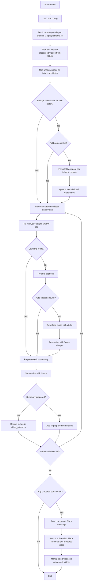

# YouTube Caption Summary

This project is now just one Dockerized Python runner.

What it does:
- fetches recent videos from configured YouTube channels via the YouTube Data API uploads playlist
- skips videos already stored in SQLite
- fetches existing YouTube captions with `yt-dlp`
- falls back to local transcription with `faster-whisper` if captions are missing
- summarizes through Nexos
- posts one parent Slack message per run and one threaded reply per video

Flow:



Required `.env` values:
- `YOUTUBE_API_KEY`
- `YOUTUBE_CHANNEL_IDS`
- `NEXOS_API_KEY`
- `SLACK_BOT_TOKEN`
- `SLACK_CHANNEL`

Optional:
- `FALLBACK_CHANNEL_IDS=` optional separate channel list for random fallback; defaults to `YOUTUBE_CHANNEL_IDS`
- `YOUTUBE_MAX_RESULTS=5` per channel, per run
- `RANDOM_FALLBACK_ENABLED=true`
- `RANDOM_FALLBACK_POOL=50` recent videos per channel to consider when there are no new videos
- `MIN_SUMMARIES_PER_RUN=3`
- `MAX_SUMMARIES_PER_RUN=6`
- `FALLBACK_ATTEMPT_MULTIPLIER=3` controls how many extra fallback candidates are queued when topping up a batch
- `NEXOS_MODEL=GPT 5.4 (Public)`
- `CAPTION_LANGUAGE=en`
- `ALLOW_AUTO_CAPTIONS=true`
- `TRANSCRIBE_ON_MISSING_CAPTIONS=true`
- `WHISPER_MODEL=small`
- `HTTP_TIMEOUT_SECONDS=90`
- `HTTP_RETRY_COUNT=3`
- `HTTP_RETRY_BACKOFF_SECONDS=2`
- `YTDLP_INACTIVITY_TIMEOUT_SECONDS=480`
- `YTDLP_POLL_INTERVAL_SECONDS=2`

Run it:

```bash
docker compose build summary-runner
docker compose run --rm summary-runner
```

State is stored in SQLite inside the `runner_data` Docker volume at `/data/state.db`.
Tables:
- `processed_videos`: videos successfully posted to Slack
- `video_attempts`: videos skipped or failed, with the latest reason
Logs are written to `/logs/runner.log` inside the container and persisted in the `runner_logs` Docker volume.

To change how many recent videos are checked per channel on each run, edit `YOUTUBE_MAX_RESULTS` in `.env`.
If there are too few unseen videos to reach the minimum batch, the runner can top up candidates from a larger recent fallback pool.
The runner only posts to Slack when it prepares at least `MIN_SUMMARIES_PER_RUN` summaries, and it stops collecting after `MAX_SUMMARIES_PER_RUN`.
YouTube discovery uses the uploads playlist via `playlistItems.list`, which keeps API usage much lower than `search.list`.
Audio downloads now use an inactivity timeout, not a hard wall-clock timeout, so `yt-dlp` can continue as long as the file keeps growing.
Whisper model/cache files are stored in the `whisper_models` Docker volume so they are not re-downloaded every run.
Other Whisper settings use built-in defaults: `cpu`, `int8`, and `en`.

Inspect saved state:

```bash
docker run --rm -v youtube-caption-summary-n8n_runner_data:/data -v "$PWD/scripts:/scripts" python:3.12-slim python /scripts/show_state.py
```
